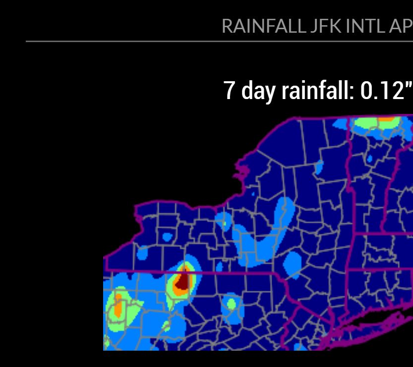

# MMM-RecentRainfall
MagicMirror module to get recent US Rainfall amounts.
version 1.01 changes by Kayakbabe aka Kelly Eberhard Allen
  adding more options from the rcc-acis.org api in order to zoom in on smaller areas
  such as county or that defined by gps coordinates as some states are very large
  and some users may only want to see their own county or a defined area.

  WARNING: THIS IS IN DEVELOPMENT_ THIS IS NOT RELEASED AS WORKING YET.
           this message will be removed when this module is working.

  requires ^MagicMirror 2.26

## API
Uses the open/free api https://data.rcc-acis.org/StnData   http://www.rcc-acis.org/docs_webservices.html

By default this module will show the entire state

Examples of other ways to define display area are shown below:


## Preview


## Using the module
run https://github.com/Kayakbabe/MMM-RecentRainfall.git
from inside your MagicMirror/modules folder

Add `MMM-RecentRainfall` module to the `modules` array in the `config/config.js` file:

### To display your entire state, define state_id and also station_id (an international airport code near your are will work)

````javascript
modules: [
  {
    module: "MMM-RecentRainfall",
    position: "top_right",
    header: "Rainfall JFK INTL AP",
    config: {
        station_id: 'JFK', // id via http://www.rcc-acis.org/docs_metadata.html
        days_to_get: 7, // number greater than 1
        show_image: true, // show the departure from normal as an image
        state_id: 'ny', // if show_image is true, then this is required
        image_width: 150 // if show_image is true, then this is required
    }
  },
]
````

### You may show an area defined by a bounding box of latitude and longtitude
bbox	Bounding box. A latitude/longitude bounding box defined in decimal degrees (West, South, East, North) with negative values indicating west longitude and south latitude (e.g. -90.7, 40.5, -88.9, 41.5).

````javascript
modules: [
  {
    module: "MMM-RecentRainfall",
    position: "top_right",
    header: "Rainfall",
    config: {
        station_id: 'JFK', // id via http://www.rcc-acis.org/docs_metadata.html
        days_to_get: 7, // number greater than 1
        show_image: true, // show the departure from normal as an image
        state_id: 'ny', // if show_image is true, then this is required
        bbox: '(-90.7, 40.5, -88.9, 41.5)', // (West, South, East, North) 
        image_width: 150 // if show_image is true, then this is required
    }
  },
]
````
